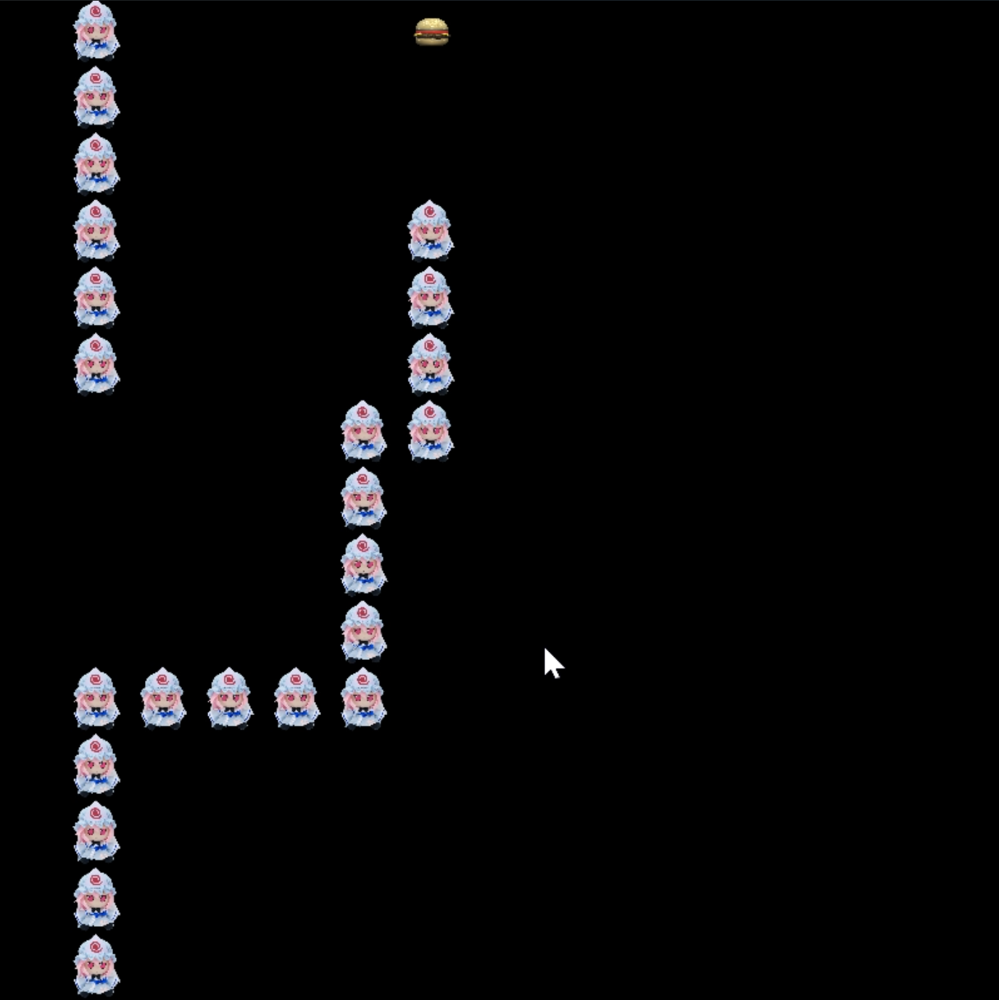

# Gluttony Yuyuko

Gluttony Yuyuko is a simple 2D snake-style game developed with C++ and SFML.

This project was created as a personal C++ practice project. It demonstrates basic game loop design, keyboard input handling, collision detection, random food generation, image loading, audio playback, and object-oriented programming in C++.

## Demo Video

[]

## Features

- 2D snake-style gameplay
- Grid-based character movement
- Direction control using keyboard input
- Food generation with different food types
- Collision detection and score-related logic
- Image and audio resource loading
- Game start handling with mouse input
- Object-oriented structure with multiple classes
- Built and debugged with Visual Studio 2022

## Controls

- Arrow keys: Move the character
- Left mouse click: Start the game

## Technologies

- C++
- SFML 2.6.0
- Visual Studio 2022
- Windows x64

## Project Structure

```text
Gluttony-Yuyuko/
├── 貪吃幽幽子.sln
├── 貪吃幽幽子/
│   ├── main.cpp
│   ├── game_class.cpp / game_class.h
│   ├── food_class.cpp / food_class.h
│   ├── sound_class.cpp / sound_class.h
│   ├── Saigyouji_Yuyuko_Fomo_class.cpp / .h
│   ├── images/
│   ├── music/
│   └── SFML-2.6.0/
```

## How to Build

1. Open `貪吃幽幽子.sln` with Visual Studio 2022.

2. Set the build configuration to:

```text
Debug | x64
```

3. Make sure the SFML include path is set to:

```text
$(ProjectDir)SFML-2.6.0\include
```

4. Make sure the SFML library path is set to:

```text
$(ProjectDir)SFML-2.6.0\lib
```

5. For Debug mode, link the following SFML libraries:

```text
sfml-graphics-d.lib
sfml-window-d.lib
sfml-system-d.lib
sfml-audio-d.lib
sfml-network-d.lib
```

6. Make sure the working directory is set correctly so that the `images/` and `music/` folders can be loaded at runtime.

7. Press `F5` or click `Local Windows Debugger` to run the game.

## What This Project Demonstrates

Through this project, I practiced and implemented:

- C++ class design
- Splitting code into header and source files
- Using a third-party C++ library
- SFML window creation and rendering
- Game loop structure
- Keyboard and mouse event handling
- Collision detection
- Random food spawning
- Image and audio resource management
- Visual Studio project configuration and debugging

## Notes

This project is for personal learning and portfolio demonstration purposes.

Some character images and audio files may be fan-made or third-party assets. They are not intended for commercial use. If this project is used as a public portfolio project, the assets should be reviewed or replaced with properly licensed resources.
